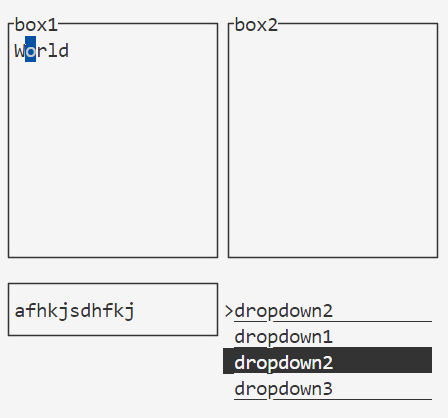

# 单头文件实现的tui工具
## 实现功能
    - 标签文本
    - box
    - 下拉框
    - 文本框, 基本文本编辑
    - 键盘读取与控制
    - 光标移动

# 效果


# 测试
```
./rebuild.sh

# q或Ctrl^C退出
# 回车 -> 进入下拉框
# i进入编辑模式, 输入字符后编辑
# esc退出编辑模式, 上下左右移动光标
```

# demo测试
```c
#include "tui.h"
#include <signal.h>

struct ui_t *g_ui = NULL;

void draw_box1(struct ui_t *ui) {ui_box(ui, "box1");}
void draw_box2(struct ui_t *ui) { ui_box(ui, "box2"); }
void draw_text(struct ui_t *ui) { ui_text(ui, "text1");}
void draw_retext(struct ui_t *ui) { ui_retext(ui, "text1", "World");  }
void draw_retext1(struct ui_t *ui) { ui_retext(ui, "text1", "World1");  }
void draw_input(struct ui_t *ui) { ui_input_field(ui, "input1"); }
void draw_dropdown(struct ui_t *ui) { ui_dropdown_close(ui, "dropdown1"); }
void exit_handler(int sig) {ui_free(g_ui);}

void key_event(struct ui_t *ui) {
    static bool is_ctrl_mode = true;
    int ch = ui_read_key();
    if(ch == EOF)   return ;
    
    if(!is_ctrl_mode) {
        if(ch == ESC) {
            is_ctrl_mode = true;
            return;
        }else if(ch == BACKSPACE) ui_input_field_del_ch(ui, "input1");
        else                      ui_input_field_add_ch(ui, "input1", ch);
        list_push(g_ui->event_list, draw_input);
    }
    
    if(ch == 'q') ui_free(g_ui);
    else if(ch == ARROW_LEFT) ui_text_cursor(ui, "text1", -1);
    else if(ch == ARROW_RIGHT) ui_text_cursor(ui, "text1", 1);
    else if(ch == 'i' && is_ctrl_mode) {
        is_ctrl_mode = false;
        return;
    }
    else if(ch == RET) ui_dropdown_open(ui, "dropdown1", 1);
    // else { printf("%d\n", ch); }
}

void main()
{
    signal(SIGINT, exit_handler);
    signal(SIGSEGV, exit_handler);
    signal(SIGABRT, exit_handler);

    g_ui = ui_new();
    dict_put(g_ui->box_dict, "box1", &(struct ui_box_t){1, 1, 20, 10, "box1"});
    dict_put(g_ui->box_dict, "box2", &(struct ui_box_t){1, 21, 20, 10, "box2"});
    dict_put(g_ui->text_dict, "text1", &(struct ui_text_t){2, 2, "Hello", TEXT_NONE, 1});
    dict_put(g_ui->input_dict, "input1", &(struct ui_input_t){11, 1, 20, 3, "", TEXT_NONE});

    struct ui_dropdown_t dropdown = {12, 21, 20, "choose one dropdown", make_list(), 0};
    list_push(dropdown.list, "dropdown1");
    list_push(dropdown.list, "dropdown2");
    list_push(dropdown.list, "dropdown3");
    dict_put(g_ui->dropdown_dict, "dropdown1", &dropdown);

    list_push(g_ui->long_life_event, key_event);

    list_push(g_ui->event_list, draw_box1);
    list_push(g_ui->event_list, draw_box2);
    list_push(g_ui->event_list, draw_text);
    list_push(g_ui->event_list, draw_retext);
    list_push(g_ui->event_list, draw_input);
    list_push(g_ui->event_list, draw_dropdown);
    
    ui_loop(g_ui);
}
```